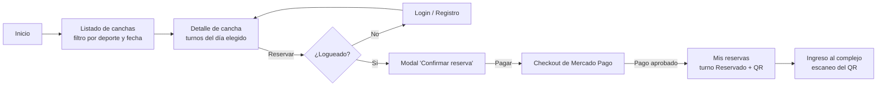
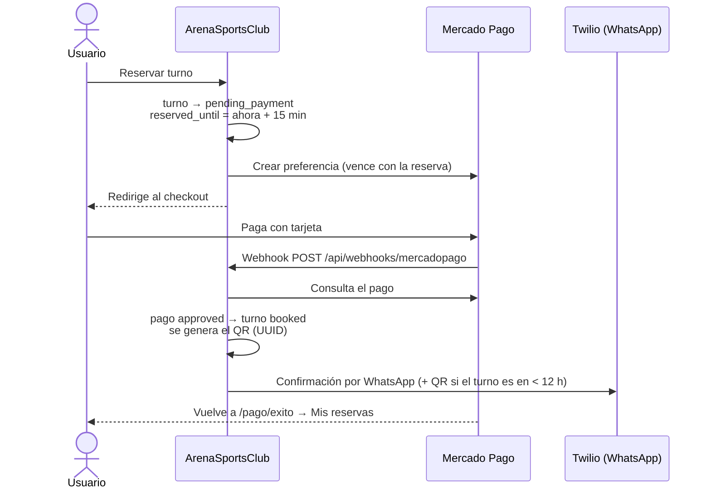
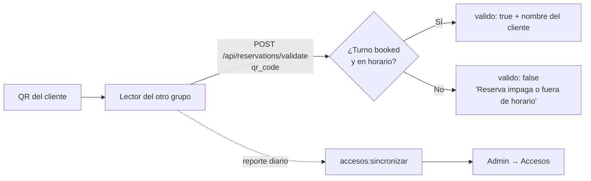
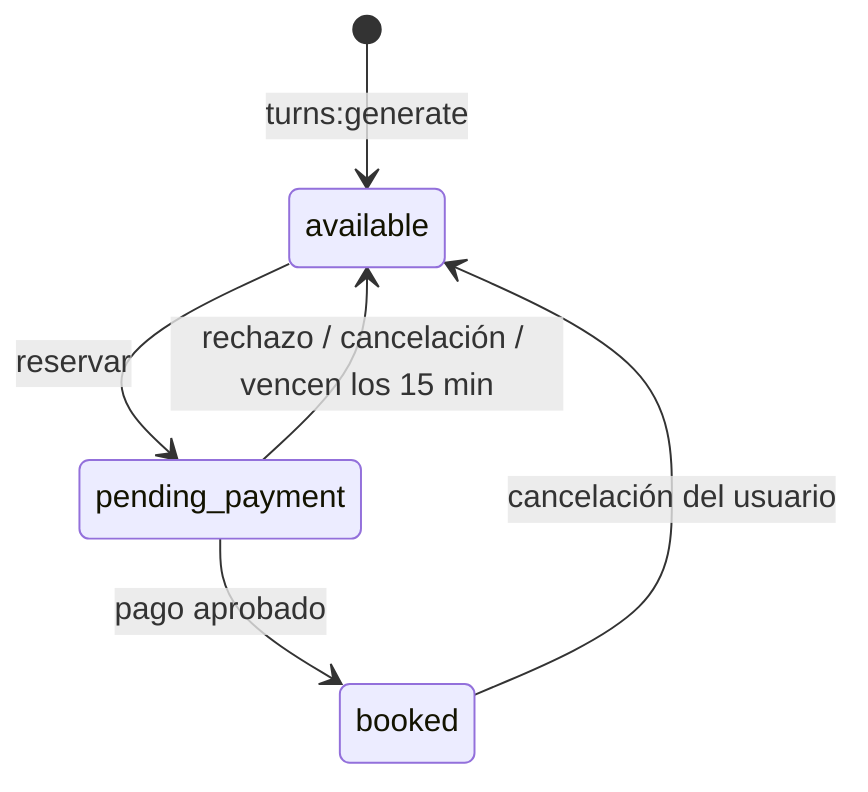

# Flujo de la aplicación — ArenaSportsClub

ArenaSportsClub es un sistema de reservas de canchas deportivas: los clientes
reservan y pagan un turno online, reciben un código QR de acceso y lo
presentan en la entrada del complejo, donde lo valida el sistema de control
de accesos (desarrollado por otro grupo).

**Stack:** Laravel 12 · Livewire 3 / Volt · Alpine.js · Tailwind · SQLite.
**Integraciones:** Mercado Pago (Checkout Pro), Twilio (WhatsApp), API de
control de accesos del otro grupo.

---

## 1. Roles

| Rol | Qué puede hacer |
|---|---|
| **Visitante** | Ver el inicio, las canchas, sus horarios y comentarios. Registrarse. |
| **Usuario** (`role = usuario`) | Reservar y pagar turnos, ver *Mis reservas* con sus QR, cancelar, comentar canchas donde jugó, editar su perfil. |
| **Administrador** (`role = admin`) | Todo lo anterior + el panel `/admin`: dashboard, canchas, deportes, turnos, reembolsos, comentarios, accesos y datos del club. |

---

## 2. Recorrido del cliente

- **Inicio:** estadísticas reales (clientes, canchas activas, reservas
  confirmadas, calificación promedio), carrusel con las últimas canchas,
  promoción y cómo funciona.
- **Detalle de cancha:** muestra los turnos de la fecha elegida. Para el día
  de hoy **solo aparecen los turnos que todavía no empezaron**. También se
  ven los comentarios y la calificación de la cancha.
- **Registro:** pide nombre, email, celular y contraseña. El celular se
  guarda en formato internacional (`+549…`), que es el que exige WhatsApp.

---

## 3. Reserva y pago (el flujo central)

1. **Reserva** (`court-detail`, método `reserve`): dentro de una transacción
   con bloqueo (`lockForUpdate`) se toma el turno si sigue disponible, pasa a
   `pending_payment` y queda reservado **15 minutos** para ese usuario
   (`Turn::PAYMENT_WINDOW_MINUTES`). El índice único cancha + fecha + hora y el
   bloqueo evitan que dos personas reserven el mismo turno.
2. **Preferencia de pago** (`MercadoPagoService`): se crea un registro
   `Payment` en estado `pending` y una preferencia de Checkout Pro con el
   precio del turno, la URL del webhook y **el mismo vencimiento que la
   reserva**, así Mercado Pago no deja pagar un turno ya liberado.
3. **Webhook** (`MercadoPagoController` → `ReservationPaymentHandler`):
   Mercado Pago avisa el resultado; la app consulta el pago y:
   - **aprobado** → el turno pasa a `booked`;
   - **rechazado / cancelado** → el turno vuelve a `available`;
   - **aprobado tarde** (el turno ya lo tomó otro usuario) → no se toca esa
     reserva y el pago queda en `refund_pending` para devolverlo;
   - avisos repetidos de un pago ya cancelado o reembolsado se ignoran.
4. **QR y WhatsApp** (`TurnObserver`): cuando un turno pasa a `booked` se
   genera su código QR (un UUID único) y se manda la confirmación por
   WhatsApp. Si el turno es dentro de las próximas 12 horas se adjunta el QR
   (como imagen, por una URL firmada que vence en 24 h); si no, el QR llega
   después con el recordatorio.

### Vencimiento de las reservas sin pagar

Si el usuario abandona el checkout, Mercado Pago no avisa nada. Para que el
turno no quede bloqueado para siempre, `Turn::releaseExpiredReservations()`
libera los `pending_payment` vencidos (y marca sus pagos como `expired`).
Se ejecuta **antes de mostrar o reservar turnos**, así no depende de ningún
proceso programado. El comando `turnos:liberar-vencidos` hace lo mismo desde
el scheduler.

---

## 4. Mis reservas

- Lista las reservas del usuario con su estado: **Reservado** o **Pago
  pendiente** (con la hora límite para pagar).
- **QR de acceso:** se muestra en la reserva y se puede descargar. Se habilita
  **15 minutos antes** del turno y vence al terminar; fuera de ese rango se ve
  en gris.
- **Pagar:** retoma el pago de una reserva pendiente (si no venció).
- **Cancelar** (con modal de confirmación):
  - con **24 h o más** de anticipación → el pago pasa a `refund_pending` y
    aparece en *Admin → Reembolsos*;
  - con **menos de 24 h** → `cancelled_no_refund` (el club se queda con el
    pago);
  - en ambos casos el turno vuelve a estar disponible y **se le borra el QR**,
    para que el próximo que lo reserve reciba uno nuevo.

---

## 5. Ingreso al complejo (integración con control de accesos)

- **Validación:** el lector del otro grupo consulta
  `POST /api/reservations/validate` con el `qr_code`. Es válido si el turno
  está `booked` y la hora actual está entre 15 minutos antes del inicio y el
  final del turno.
- **Sincronización:** el comando `accesos:sincronizar` (cada hora) trae el
  reporte diario de escaneos de la API del otro grupo (`CANCHAS_API_URL`,
  con `CANCHAS_API_TOKEN`) y lo guarda en `access_logs`, que se ve en
  *Admin → Accesos*.

---

## 6. Panel de administración (`/admin`)

| Sección | Qué hace |
|---|---|
| **Dashboard** | Reservas de hoy, próximas reservas, pagos pendientes, ingresos de los últimos 30 días, canchas activas y reembolsos pendientes. |
| **Canchas** | Alta, edición y baja (borrado suave: las reservas existentes se conservan). Las fotos se redimensionan y comprimen al subirlas. |
| **Deportes** | Alta, edición y baja (no se puede borrar un deporte con canchas). Cada deporte define horario y duración de los turnos. |
| **Turnos** | Listado con búsqueda por cancha y filtros por estado y fecha. |
| **Reembolsos** | Pagos `refund_pending`; el admin los marca como reembolsados. |
| **Comentarios** | Moderación de las reseñas de las canchas. |
| **Accesos** | Escaneos sincronizados desde el control de accesos. |
| **Club** | Datos de contacto y horarios del complejo. |

Las acciones destructivas piden confirmación con un modal propio de la app.

---

## 7. Estados

**Turno** (`turns.status`)

**Pago** (`payments.status`): `pending` → `approved` / `rejected` /
`expired`; un pago aprobado puede pasar a `refund_pending` → `refunded`
(cancelación con 24 h o más) o a `cancelled_no_refund` (con menos de 24 h).

---

## 8. Tareas programadas y comandos

| Comando | Cuándo | Qué hace |
|---|---|---|
| `turns:generate {--days=30}` | A mano (no está agendado) | Crea los turnos disponibles de cada cancha activa según el horario y la duración de su deporte. No duplica los existentes. |
| `turnos:recordatorio` | Cada hora | Manda por WhatsApp el recordatorio con el QR a los turnos que empiezan en 11–12 h. |
| `turnos:liberar-vencidos` | Cada 5 minutos | Libera las reservas cuyo plazo para pagar venció. |
| `accesos:sincronizar` | Cada hora | Trae el reporte de escaneos del control de accesos. |
| `db:seed --class=DemoDataSeeder` | A mano | Carga datos de demostración (clientes ficticios, reservas pasadas y comentarios). `demo:borrar` los saca. |

Para que corran los agendados hace falta el scheduler
(`php artisan schedule:work` en local, o el cron de `schedule:run` en el hosting).

---

## 9. Configuración (`.env`)

| Variable | Para qué |
|---|---|
| `APP_URL` | URL pública de la app. En local se usa la del túnel (ver abajo). |
| `MP_ACCESS_TOKEN`, `MP_PUBLIC_KEY` | Credenciales de Mercado Pago (de un **vendedor de prueba** para no cobrar dinero real). |
| `MP_WEBHOOK_URL` | URL pública del webhook: `<APP_URL>/api/webhooks/mercadopago`. |
| `TWILIO_SID`, `TWILIO_AUTH_TOKEN`, `TWILIO_WHATSAPP_FROM` | Twilio. En el sandbox el número es `+14155238886`. |
| `CANCHAS_API_URL`, `CANCHAS_API_TOKEN` | API del control de accesos del otro grupo. |

**Por qué hace falta un túnel en local:** Mercado Pago (webhook) y Twilio
(imagen del QR) tienen que poder llegar a la app desde internet, y
`localhost` no es accesible desde afuera. Con
`cloudflared tunnel --url http://localhost` se obtiene una URL pública
temporal (`https://….trycloudflare.com`) que se pone en `APP_URL` y
`MP_WEBHOOK_URL`. Esa URL **cambia cada vez que se levanta el túnel**.

**Sandbox de WhatsApp:** solo recibe mensajes quien se unió mandando
`join <código>` al número del sandbox; la unión dura 72 h y WhatsApp solo
permite mensajes libres dentro de las 24 h posteriores al último mensaje del
usuario.
